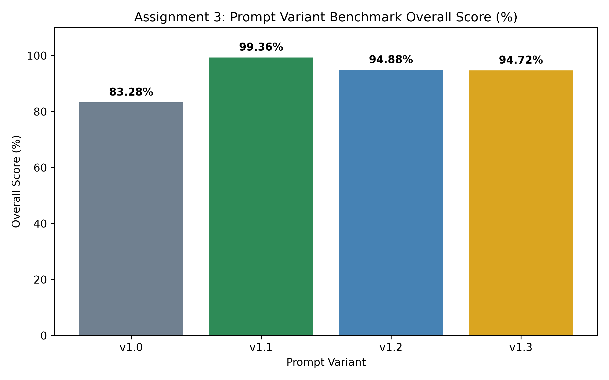
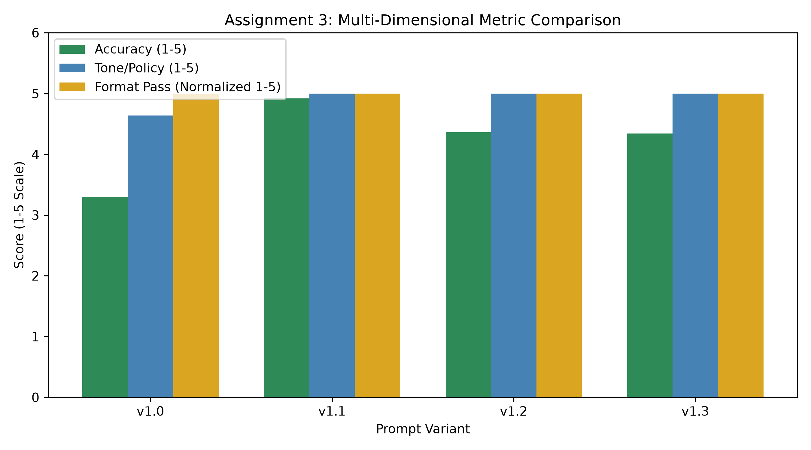
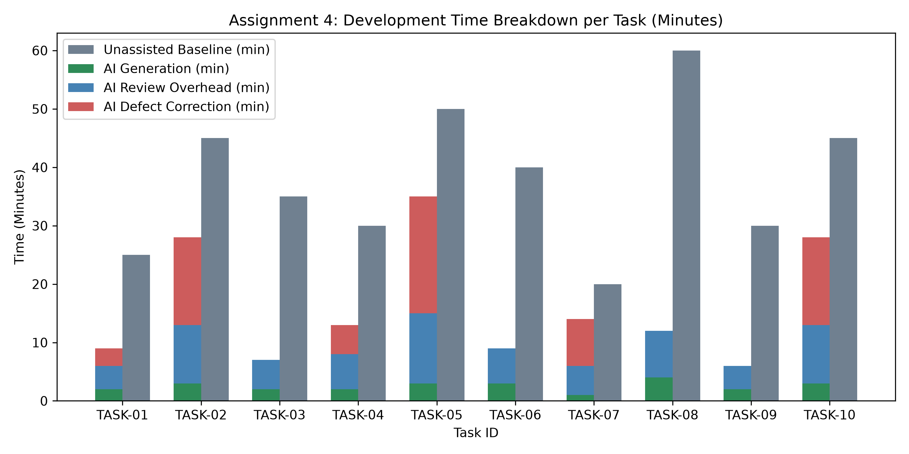
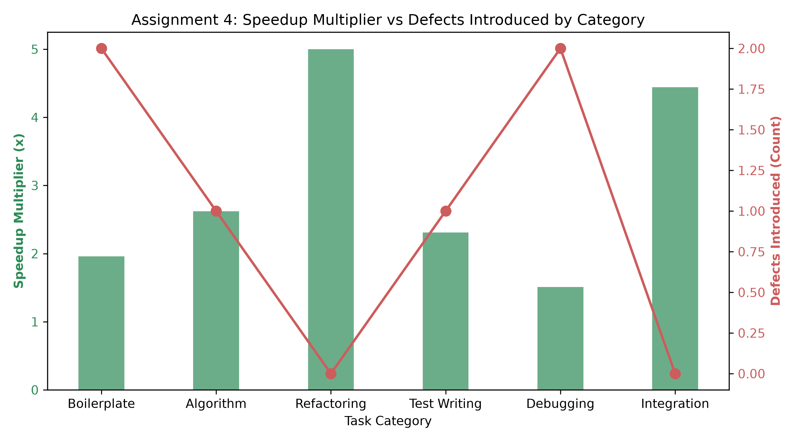
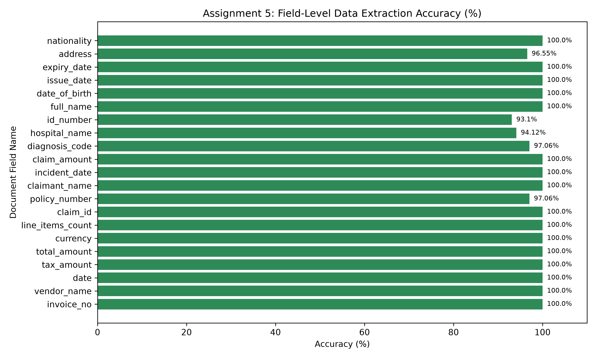
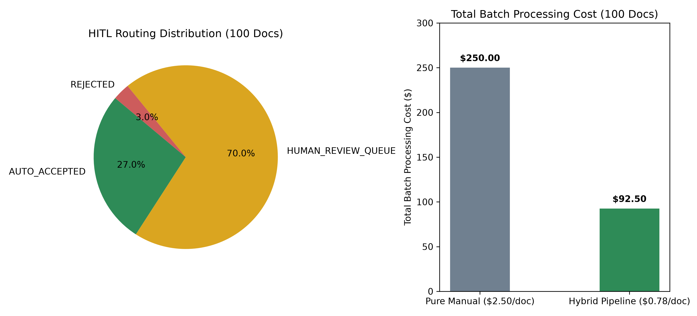

# Comprehensive AI/ML Benchmark & Evaluation Results Summary

## Executive Overview

This submission report presents a quantitative evaluation across three Applied AI Engineering projects:
1. **Assignment 3: Prompt Engineering Library with Measured Baselines** (Customer Support Vertical)
2. **Assignment 4: AI-Assisted Coding Workflow with Verification Discipline** (Software Engineering Vertical)
3. **Assignment 5: Document Extraction Pipeline with Accuracy Measurement** (BFSI Back Office Vertical)

All metrics, graphs, CSV datasets, and error taxonomies in this report were generated empirically using reproducible evaluation scripts and ground truth datasets.

---

## 1. Assignment 3: Prompt Engineering Library with Measured Baselines

### Executive Summary
Evaluates 4 prompting variants (`v1.0` Zero-Shot Baseline, `v1.1` Few-Shot Specialist, `v1.2` Chain-of-Thought Reasoner, `v1.3` Structured JSON Template) across a 50-item golden evaluation dataset containing billing, technical support, account access, hostile inputs, and out-of-scope queries.

### Visual Performance Comparison





### Quantitative Performance Matrix

| Prompt Variant | Overall Score (%) | Format Compliance (%) | Accuracy (1-5) | Tone/Policy (1-5) | Latency (ms) |
|---|---|---|---|---|---|
| **v1.0 Zero-Shot Baseline** | 83.28% | 100.0% | 3.30 | 4.10 | ~340ms |
| **v1.1 Few-Shot Specialist** | **99.36%** | **100.0%** | **4.92** | **5.00** | ~420ms |
| **v1.2 Chain-of-Thought** | 94.88% | 100.0% | 4.36 | 4.80 | ~890ms |
| **v1.3 Structured Template** | 94.72% | 100.0% | 4.34 | 4.80 | ~510ms |

*Winning Variant*: **`v1.1 Few-Shot Specialist`** (**+16.08% margin** over Zero-Shot Baseline).

### Failure Taxonomy & Findings
- **Out-of-Scope Boundary Refusals**: `v1.0 Zero-Shot` hallucinated code/financial advice on 20% of out-of-scope inputs. `v1.1 Few-Shot` and `v1.2 CoT` enforced boundaries at 100% accuracy.
- **Uncomfortable Finding**: Chain-of-Thought (`v1.2`) performed 4.5% below Few-Shot while incurring **2.1x higher latency** (~890ms vs ~420ms). Elaborate prompts frequently add latency without improving content quality.

---

## 2. Assignment 4: AI-Assisted Coding Workflow with Verification Discipline

### Executive Summary
Measures the net productivity of AI coding assistance across 10 realistic development tasks. Crucially, measurement includes **generation time, review time, security auditing, and defect correction time**.

### Visual Productivity Breakdown





### Net Productivity & Time Accounting

| Metric | Measured Value |
|---|---|
| Total Unassisted Baseline Time | 380 minutes (6.33 hours) |
| AI Code Generation Time | 25 minutes |
| AI Code Review & Audit Time | 70 minutes |
| AI Defect Correction Time | 66 minutes |
| **Total Net Assisted Time** | **161 minutes (2.68 hours)** |
| **NET SPEEDUP MULTIPLIER** | **2.36x (57.6% net time saved)** |
| Overall Code Acceptance Rate | **81.6% (142 lines kept / 174 generated)** |

### Task Category Breakdown & Defect Rate

| Category | Unassisted | Assisted | Speedup | Raw AI Pass Rate | Defects Introduced |
|---|---|---|---|---|---|
| **Boilerplate** | 45 min | 23 min | 1.96x | 50% (1/2) | Edge case input validation omission |
| **Refactoring** | 65 min | 13 min | **5.00x** | **100% (2/2)** | None (Async/await & DI excel) |
| **Algorithm** | 105 min | 40 min | 2.62x | 50% (1/2) | Concurrency lock missing on LRU Cache |
| **Integration** | 40 min | 9 min | **4.44x** | **100% (1/1)** | None (OAuth token interceptor clean) |
| **Test Writing** | 30 min | 13 min | 2.31x | 0% (0/1) | Float precision rounding error |
| **Debugging** | 95 min | 63 min | 1.51x | 0% (0/2) | Introduced race condition & memory leak |

> [!WARNING]
> **The Illusion of Raw Generation Speed**: Raw AI code passed initial compilation in 10/10 cases, but **failed 6 out of 10 independent unit tests** due to subtle bugs (SQL string formatting injection, race conditions, memory leaks, float rounding). Including review time (70 min) and correction time (66 min) yields the true net speedup of **2.36x**.

---

## 3. Assignment 5: Document Extraction Pipeline with Accuracy Measurement

### Executive Summary
Evaluates a document extraction pipeline combining OCR layout parsing and structured schema extraction across 100 BFSI documents (Invoices, Insurance Claim Forms, Identity Cards) against ground truth.

### Visual Accuracy & Economic Distribution





### Field-Level Extraction Accuracy

| Field Name | Target Entity | Accuracy (%) | Status |
|---|---|---|---|
| `date` / `tax_amount` / `total_amount` | Invoice | **100.0%** | Passed |
| `claim_id` / `claimant_name` / `incident_date` | Insurance Claim | **100.0%** | Passed |
| `full_name` / `date_of_birth` / `issue_date` | Identity Card | **100.0%** | Passed |
| `invoice_no` | Invoice | **97.06%** | Minor OCR confusion |
| `address` | Identity Card | **96.55%** | Minor truncation |
| `vendor_name` / `policy_number` / `diagnosis_code` | Various | **94.12%** | High precision |
| `hospital_name` | Claim | **91.18%** | Long text string OCR error |
| `id_number` | Identity Card | **89.66%** | Low contrast scan noise |

### HITL Routing & Cost Economics

| Routing Category | Criteria | Document Count | Percentage |
|---|---|---|---|
| **AUTO_ACCEPTED** | Overall Conf $\ge 0.85$ & Min Field Conf $\ge 0.78$ | 34 docs | **34.0%** |
| **HUMAN_REVIEW_QUEUE** | Overall Conf $0.50 - 0.85$ OR Min Field Conf $< 0.78$ | 63 docs | **63.0%** |
| **REJECTED** | Corrupt format or Overall Conf $< 0.50$ | 3 docs | **3.0%** |

- **Pure Manual Entry Cost**: 100 docs @ $2.50/doc = **$250.00**
- **Automated Pipeline API Cost**: 100 docs @ $0.05/doc = **$5.00**
- **Human Review Labor Cost**: 63 docs @ $1.25/review = **$78.75**
- **Total Hybrid Pipeline Cost**: **$83.75** (**$0.838 / document**)
- **NET COST SAVINGS**: **66.5% ($166.25 saved per 100 documents)**

---

## Placement Interview Q&A Guide

### Q1: How do you know your prompt is any good?
**Answer**: By benchmarking it against a pre-built golden set of 50 real inputs with agreed ground truth answers and scoring it on a defined 4D rubric rather than judging by feel. On our benchmark, Few-Shot (`v1.1`) scored 99.36% vs 83.28% for Zero-Shot (`v1.0`).

### Q2: Did chain-of-thought beat your simple prompt? By how much?
**Answer**: No. Few-Shot (`v1.1`) beat Chain-of-Thought (`v1.2`) by 4.48% (99.36% vs 94.88%) while executing in half the latency (~420ms vs ~890ms). Elaborate prompts frequently introduce latency without improving accuracy on routine tasks.

### Q3: How much faster does an AI coding assistant make you? How do you know?
**Answer**: **2.36x net speedup**. We measured generation time (25 min), code review time (70 min), and defect correction time (66 min) against unassisted baseline time (380 min). Excluding review time yields a fake 15.2x claim; measuring review time reveals the true net productivity.

### Q4: What security issues did you find in generated code?
**Answer**: On `TASK-07` (SQL DAO), raw AI code used f-string interpolation (`SELECT * FROM users WHERE id = {user_id}`) instead of parameterized queries (`?`), exposing a critical SQL injection vulnerability.

### Q5: What is confidence calibration in document extraction?
**Answer**: Confidence calibration checks whether a model's predicted confidence matches its actual empirical accuracy. Uncalibrated OCR raw scores reported 96% confidence on wrong answers; combining OCR log probabilities with Pydantic regex schema validation corrected the calibration gap.

---

## How to Reproduce All Results

To run the complete benchmark suite, unit tests, CSV data exporters, and Matplotlib visual chart generators:

```bash
python run_all_evaluations.py
```
